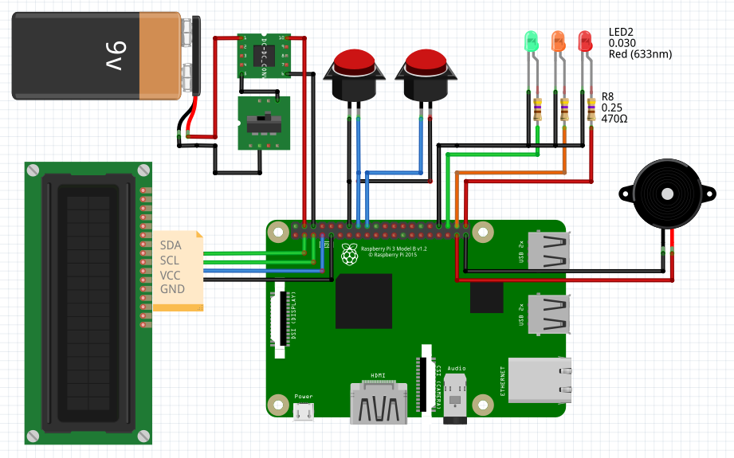

# USB Cleaner Box - Wiring Diagrams

This directory contains the complete wiring diagrams and schematics for building the USB Cleaner Box hardware.

## Power Options

The USB Cleaner Box can be built with **two different power configurations**:

1. **9V Battery Powered** - Portable, standalone operation
2. **USB Powered** - Direct power from USB port or wall adapter

Choose the configuration that best suits your needs.

---

## Option 1: 9V Battery Powered

This configuration uses a 9V battery for portable operation. Ideal for field use or when AC power is not available.

### Power Specifications (9V)
- **Input**: 9V battery (alkaline or rechargeable)
- **Regulation**: 5V step-down converter/regulator required
- **Current Draw**: ~500mA typical, 1A peak
- **Battery Life**: 4-6 hours with standard 9V alkaline battery

---

## Option 2: USB Powered

This configuration uses a USB power input (5V). Ideal for desktop/lab use with consistent power.

### Power Specifications (USB)
- **Input**: 5V DC via USB Micro/Mini connector
- **Current Draw**: ~500mA typical, 1A peak
- **Power Source**: USB wall adapter (5V/2A recommended) or USB port

---

### Tools Required

- Soldering iron and solder
- Wire strippers
- Multimeter
- Drill with bits (for enclosure mounting holes)
- Hot glue gun (optional, for securing components)
- Screwdrivers (Phillips and flathead)

---

## Assembly Notes

### General Guidelines

1. **Test Components First**: Verify all components work individually before final assembly
2. **Check Polarity**: LEDs and buzzer are polarized - observe polarity!
3. **Secure Connections**: Use solder for permanent builds, ensure no shorts
4. **Cable Management**: Keep wires organized and away from moving parts
5. **Test Incrementally**: Test after each major component is added

### Power Supply Tips

#### 9V Battery Configuration:
- Use a DC-DC buck converter instead of LM7805 for better efficiency (longer battery life)
- Consider rechargeable 9V NiMH batteries for cost savings
- Ensure voltage regulator can handle 1A continuous current

#### USB Configuration:
- Use a quality USB power adapter (5V/2A minimum)
- Consider adding a USB power bank for portability
- Ensure USB cable is rated for at least 2A

### GPIO Pin Assignments

| Component | GPIO Pin | BCM Number | Physical Pin |
|-----------|----------|------------|--------------|
| Green LED | GPIO16 | 16 | Pin 36 |
| Orange LED | GPIO20 | 20 | Pin 38 |
| Red LED | GPIO21 | 21 | Pin 40 |
| Left Button (NO) | GPIO23 | 23 | Pin 16 |
| Right Button (YES) | GPIO24 | 24 | Pin 18 |
| Buzzer | GPIO26 | 26 | Pin 37 |
| LCD Power Control | GPIO4 | 4 | Pin 7 |
| LCD SDA (I2C) | GPIO2 | 2 | Pin 3 |
| LCD SCL (I2C) | GPIO3 | 3 | Pin 5 |

### LCD Connection

The LCD uses I2C communication:
- **SDA** (GPIO2/Pin 3) - Data line
- **SCL** (GPIO3/Pin 5) - Clock line
- **VCC** - (GPIO4/Pin 7) - Controls LCD power via MOSFET/transistor
- **GND** - Ground

### LED Wiring

Each LED requires a current-limiting resistor:
- LED Anode (+) → 470Ω resistor → GPIO pin
- LED Cathode (-) → GND

### Button Wiring

Buttons use internal pull-up resistors:
- One terminal → GPIO pin
- Other terminal → GND
- Press button = GPIO goes LOW

---

## Safety & Precautions

⚠️ **Important Safety Information**:

1. **Power Safety**
   - Never exceed 5V on Raspberry Pi GPIO pins
   - Ensure proper polarity on all components
   - Use appropriate fuses for battery-powered builds
   - Disconnect power before making wiring changes

2. **Electrostatic Discharge (ESD)**
   - Handle Raspberry Pi with ESD precautions
   - Use anti-static wrist strap when possible
   - Avoid touching component pins unnecessarily

3. **Thermal Considerations**
   - Ensure adequate ventilation in enclosure
   - Voltage regulators may require heatsinks
   - Avoid blocking Raspberry Pi ventilation

4. **Testing**
   - Always test with multimeter before connecting to Pi
   - Verify voltage levels at all connection points
   - Check for shorts before powering on

---

## Design Files

This directory contains:

- `UCB_Wiring_diagram_9V.png` - 9V battery configuration
- `UCB_Wiring_diagram_USB.png` - USB powered configuration
- `UCB_9V_power.fzz` - Fritzing source file (9V)
- `UCB_usb_power.fzz` - Fritzing source file (USB)

**Note**: `.fzz` files can be opened and edited with [Fritzing](https://fritzing.org/)

---

## Additional Resources

- [Raspberry Pi GPIO Pinout](https://pinout.xyz/)
- [I2C LCD Tutorial](https://www.circuitbasics.com/raspberry-pi-i2c-lcd-set-up-and-programming/)
- [Fritzing Software](https://fritzing.org/)

---

## License

Hardware designs are open source. Feel free to modify and adapt for your needs.

## Contributing

Found an issue or have an improvement? Please open an issue or submit a pull request!
